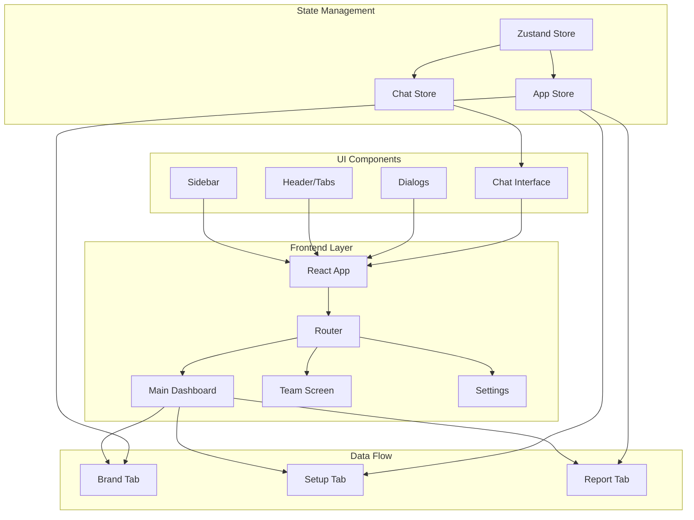
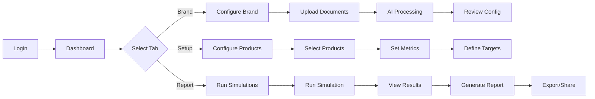

# 🚀 ODAIA - Pharmaceutical Brand Configuration Platform

<div align="center">
  
  
  
  
  
  
  
  <h3>An intelligent platform for pharmaceutical brand strategy configuration and HCP targeting optimization</h3>
  
</div>

---

## 📋 Table of Contents

- [Overview](#-overview)
- [Core Features](#-core-features)
- [Application Architecture](#-application-architecture)
- [Design System](#-design-system)
- [Project Structure](#-project-structure)
- [Component Documentation](#-component-documentation)
- [State Management](#-state-management)
- [Development Setup](#-development-setup)
- [Application Flow](#-application-flow)
- [Key Technologies](#-key-technologies)

---

## 🎯 Overview

ODAIA is a sophisticated React-based pharmaceutical configuration platform that streamlines brand strategy implementation, HCP (Healthcare Professional) targeting, and market analysis reporting. The application provides an intuitive interface for pharmaceutical teams to configure brand strategies, analyze competitive landscapes, and generate comprehensive reports.

### Mission Statement
Empower pharmaceutical teams with intelligent tools to optimize brand positioning, enhance HCP engagement strategies, and drive data-driven decision making through automated configuration and analysis.

---

## ✨ Core Features

### 🏢 **Brand Configuration**
- **Brand Strategy Management**: Define and manage comprehensive brand positioning
- **Access Strategy**: Configure PSP programs, copay cards, and web portals
- **Sales Goals**: Set and track XPO TRx targets and volume objectives
- **Competitive Landscape**: Analyze and position against competitors

### 🔧 **Setup & Configuration**
- **Product Configuration**: Define therapeutic areas and indications
- **Metrics Management**: Configure weighted scoring systems
- **Market Basket Analysis**: Build and analyze product baskets
- **HCP Targeting**: Optimize healthcare professional engagement

### 📊 **Reporting & Analytics**
- **Simulation Engine**: Run multi-scenario simulations
- **Real-time Analytics**: Live data visualization and insights
- **Report Generation**: Automated comprehensive report creation
- **Performance Tracking**: Monitor KPIs and objectives

### 🤖 **AI Assistant**
- **Intelligent Chat Interface**: Context-aware assistance
- **Document Processing**: Automated strategy document analysis
- **Pre-prompted Suggestions**: Smart workflow recommendations
- **Task Automation**: Streamlined configuration processes

---

## 🏗 Application Architecture



### Application Flow

1. **Initial Load** → User lands on Brand tab with sidebar navigation
2. **Document Upload** → AI Assistant processes brand strategy documents
3. **Configuration** → User configures brand, setup, and objectives
4. **Simulation** → System runs simulations based on configuration
5. **Report Generation** → Final comprehensive report produced

---

## 🎨 Design System

### Color Palette

#### Dark Theme (Default)
| Color Variable | Hex Code | Usage |
|---------------|----------|-------|
| `--bg-main` | `#0a0c10` | Main application background |
| `--bg-secondary` | `#1a1a1a` | Assistant panel, secondary surfaces |
| `--bg-card` | `#15171d` | Card components |
| `--bg-modal` | `#1a1f2e` | Modal dialogs |
| `--text-primary` | `#ffffff` | Primary text |
| `--text-secondary` | `#8b92a3` | Secondary text |
| `--accent-blue` | `#3b82f6` | Primary actions, links |
| `--accent-teal` | `#14b8a6` | Success states |
| `--accent-yellow` | `#f59e0b` | Warning states |

#### Light Theme
| Color Variable | Hex Code | Usage |
|---------------|----------|-------|
| `--bg-main` | `#ffffff` | Main application background |
| `--bg-secondary` | `#f9fafb` | Assistant panel |
| `--text-primary` | `#111827` | Primary text |
| `--text-secondary` | `#6b7280` | Secondary text |

### Typography

- **Font Family**: Inter, -apple-system, BlinkMacSystemFont, 'Segoe UI'
- **Font Sizes**:
  - Heading 1: 20px (600 weight)
  - Heading 2: 16px (500 weight)
  - Heading 3: 14px (500 weight)
  - Body: 14px (400 weight)
  - Small: 12px (400 weight)

### Spacing System
- Base unit: 8px grid
- Common spacings: 8px, 12px, 16px, 20px, 24px, 32px

---

## 📁 Project Structure

```
Odaia-v2/
├── public/
│   └── vite.svg
├── src/
│   ├── components/          # Reusable UI components
│   │   ├── Badge.tsx        # Status badges
│   │   ├── Button.tsx       # Button component
│   │   ├── Card.tsx         # Card container
│   │   ├── Dialog.tsx       # Modal dialog base
│   │   ├── Header.tsx       # App header with tabs
│   │   ├── Input.tsx        # Form inputs
│   │   ├── Sidebar.tsx      # Navigation sidebar
│   │   ├── Chat/            # Chat components
│   │   │   ├── ChatInterface.tsx
│   │   │   ├── ChatMessage.tsx
│   │   │   └── PrePromptedButton.tsx
│   │   ├── Report/          # Reporting components
│   │   │   ├── SimulationRunner.tsx
│   │   │   ├── SimulationResults.tsx
│   │   │   └── FinalReportView.tsx
│   │   └── Setup/           # Setup components
│   │       ├── BasketSection.tsx
│   │       ├── MetricsTable.tsx
│   │       └── ProductTreeModal.tsx
│   ├── dialogs/             # Modal dialogs
│   │   ├── BrandAccessDialog.tsx
│   │   ├── HCPTargetingDialog.tsx
│   │   ├── NewProjectDialog.tsx
│   │   └── EditBrandDialog.tsx
│   ├── screens/             # Main application screens
│   │   ├── MainDashboard.tsx
│   │   ├── TeamScreen.tsx
│   │   ├── DocumentsScreen.tsx
│   │   ├── SettingsScreen.tsx
│   │   ├── ProfileScreen.tsx
│   │   ├── SetupTab.tsx
│   │   └── ReportTab.tsx
│   ├── store/               # State management
│   │   ├── appStore.ts      # Global application state
│   │   └── chatStore.ts     # Chat interface state
│   ├── lib/                 # Utilities
│   │   └── utils.ts         # Helper functions
│   ├── App.tsx              # Main app component
│   ├── main.tsx            # App entry point
│   ├── index.css           # Global styles & theme
│   └── App.css             # App-specific styles
├── package.json
├── vite.config.ts
├── tsconfig.json
└── tailwind.config.js
```

---

## 🧩 Component Documentation

### Core Components

#### **App.tsx**
Main application container that manages routing, tab navigation, and modal state.
- Handles theme initialization
- Manages active tab state (Brand/Setup/Report)
- Controls modal dialog visibility
- Renders appropriate screens based on sidebar selection

#### **Sidebar.tsx**
Navigation component providing access to different application sections.
- Team management
- Document library
- Settings configuration
- User profile
- Brand navigation (via logo click)

#### **Header.tsx**
Tab navigation component for main dashboard sections.
- Renders tab buttons for Brand, Setup, Report
- Manages active tab highlighting
- Responsive to theme changes

### Feature Components

#### **MainDashboard.tsx**
Central hub displaying brand configuration cards and AI assistant.
- Left panel: AI Assistant with chat interface
- Right panel: Brand configuration cards
- Handles file uploads and processing
- Manages edit states for configuration items

#### **SetupTab.tsx**
Product configuration interface for therapeutic areas and metrics.
- Product tree selection
- Market basket configuration
- Metrics weight management
- Competitive opportunity analysis

#### **ReportTab.tsx**
Simulation and reporting interface.
- Simulation runner with progress tracking
- Results visualization
- Final report generation
- Export capabilities

### Dialog Components

#### **BrandAccessDialog.tsx**
Configure PSP programs, copay cards, and market access strategies.
- Form inputs for access programs
- Web portal configuration
- Market access documentation

#### **HCPTargetingDialog.tsx**
Healthcare professional targeting configuration.
- Specialty selection
- Targeting criteria
- Engagement strategy setup

---

## 🔄 State Management

### Zustand Stores

#### **appStore.ts**
Global application state management.

```typescript
interface AppState {
  // File Management
  uploadedFiles: UploadedFile[]
  isProcessingFile: boolean
  hasUploadedFiles: boolean
  
  // Brand Configuration
  brandConfig: BrandConfig
  productConfig: ProductConfiguration
  
  // UI State
  activeModal: string | null
  editingCardType: string | null
  theme: 'dark' | 'light'
  activeSidebarItem: string
}
```

Key Actions:
- `addFile()`: Process uploaded documents
- `updateBrandConfig()`: Modify brand settings
- `updateProductConfig()`: Update product configuration
- `setActiveModal()`: Control dialog visibility
- `toggleTheme()`: Switch between light/dark themes

#### **chatStore.ts**
Chat interface and AI assistant state.

```typescript
interface ChatState {
  messages: ChatMessage[]
  prePrompts: PrePrompt[]
  isTyping: boolean
  isThinking: boolean
  isExecutingTask: boolean
  currentStep: number
}
```

Key Actions:
- `sendUserMessage()`: Process user input
- `executeDemoStep()`: Run demo sequences
- `addAssistantMessage()`: Display AI responses

---

## 🚀 Development Setup

### Prerequisites
- Node.js 18+ 
- npm or yarn package manager
- Git

### Installation

```bash
# Clone the repository
git clone https://github.com/[your-org]/odaia.git
cd odaia/Odaia-v2

# Install dependencies
npm install

# Start development server
npm run dev

# Build for production
npm run build

# Preview production build
npm run preview

# Run linting
npm run lint
```

### Environment Variables
Create a `.env` file in the root directory:

```env
VITE_API_URL=your_api_endpoint
VITE_AUTH_TOKEN=your_auth_token
```

### Available Scripts

| Command | Description |
|---------|-------------|
| `npm run dev` | Start development server on port 5173 |
| `npm run build` | Build production bundle |
| `npm run preview` | Preview production build |
| `npm run lint` | Run ESLint checks |

---

## 🔄 Application Flow

### User Journey



### Data Flow

1. **Document Upload** → Files processed by AI assistant
2. **Configuration** → Settings stored in Zustand stores
3. **Validation** → Real-time validation of inputs
4. **Simulation** → Configuration sent to simulation engine
5. **Results** → Visualization and report generation

---

## 🛠 Key Technologies

### Frontend Framework
- **React 19.1.1**: Latest React with concurrent features
- **TypeScript 5.8.3**: Type-safe development
- **Vite 7.1.2**: Lightning-fast build tool

### State Management
- **Zustand 5.0.8**: Lightweight state management
- **LocalStorage**: Persistent state for user preferences

### Styling
- **Tailwind CSS 4.1.13**: Utility-first CSS framework
- **CSS Variables**: Dynamic theming support
- **Custom CSS**: Fine-tuned component styles

### UI Components
- **Radix UI**: Accessible component primitives
  - Dialog, Progress, Radio Group, Select, Tabs
- **Lucide React**: Modern icon library
- **Recharts**: Data visualization

### Routing
- **React Router DOM 7.9.1**: Client-side routing

### Development Tools
- **ESLint**: Code quality enforcement
- **PostCSS**: CSS processing
- **Autoprefixer**: Cross-browser compatibility

---

## 📈 Performance Considerations

- **Code Splitting**: Lazy loading for dialogs and screens
- **Memoization**: React.memo for expensive components
- **Virtual Scrolling**: For large data lists
- **Optimized Builds**: Tree shaking and minification
- **Asset Optimization**: SVG icons and image compression

---

## 🔐 Security

- **Input Validation**: All user inputs sanitized
- **Secure Storage**: Sensitive data encrypted
- **Authentication**: Token-based auth system
- **Authorization**: Role-based access control
- **XSS Protection**: Content security policies

---

## 🤝 Contributing

Please read our contributing guidelines before submitting PRs.

1. Fork the repository
2. Create your feature branch (`git checkout -b feature/AmazingFeature`)
3. Commit your changes (`git commit -m 'Add some AmazingFeature'`)
4. Push to the branch (`git push origin feature/AmazingFeature`)
5. Open a Pull Request

---

## 📝 License

This project is proprietary and confidential. All rights reserved.

---

## 👥 Team

Developed with ❤️ by the ODAIA Engineering Team

For questions or support, please contact the development team.

---

<div align="center">
  <sub>Built with modern web technologies for the future of pharmaceutical configuration</sub>
</div>